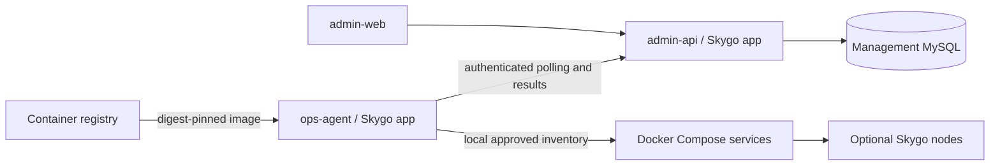

# Architecture

The management plane stores only administrators, hosts, service definitions,
operation tasks, generic configuration versions and audit entries in its own
MySQL schema. It does not require application nodes at startup.

The controller signs version-1 commands with Ed25519. Agent identity uses an
individually generated bearer token over HTTPS. Only token hashes are stored by
the controller. Public key trust is provisioned locally; the agent does not
accept key replacement from the network.

Task lifecycle: `pending → queued → dispatched → succeeded/failed/uncertain`.
Rejection applies to pending tasks. Queued tasks expire without execution.
Dispatched tasks retain their identity even after expiry so agents can return
old receipts. Expiry never authorizes a new execution. There is no automatic
retry with a new task identity after an uncertain operation.

A per-service busy task prevents concurrent mutations. Approval and terminal
results serialize inventory transitions in the database. Control-plane services
also require no queued, dispatched or uncertain tasks when approving their own
update. Running agent journals survive an API/Web upgrade; the controller never
rewrites ownership to make an upgrade proceed.

Agent receipts are atomic files with directory fsync. A single-process file lock
prevents two agents sharing the state directory. After a crash, observed desired
image/configuration and health can establish success. Operations whose outcome
cannot be proven remain uncertain. Do not delete receipts to force a retry.

Service start/update checks declared dependencies. Stop refuses while a dependent
service is healthy. Dependencies are explicit; there are no built-in roles or
business-specific drain protocols. Docker stop/restart delivers the container's
configured stop signal and uses a 30-second timeout.

Skygo registry publication uses the upstream `cluster.Snapshot` format and
revision calculation. Agents validate registry snapshots before writing the
locally approved file and restarting the selected service. The example nodes
use `cluster.FileRegistry`. The controller exposes no arbitrary Actor invocation.

Schema changes are explicit (`admin-api -migrate`) and must be run by a deployment
operator. Ordinary startup checks the schema version and never performs migration.
Schema v2 adds build trust, registered image releases, preparation receipts and a
nullable task completion timestamp. Existing installations explicitly run the
migration before starting the new API; see [release migration](releases.md).
